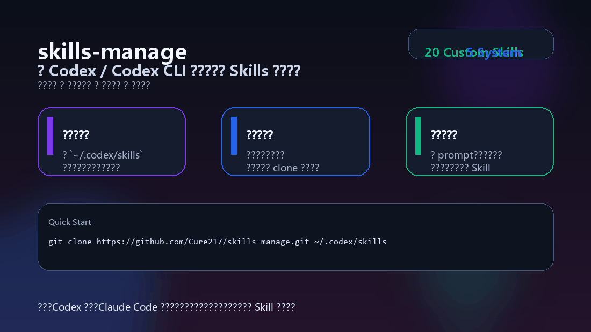

# skills-manage

<div align="center">
  <p><strong>一个面向 Codex / Codex CLI 的本地 Skills 仓库</strong></p>
  <p>集中管理、版本化同步、持续维护你的 Skills 目录，让常用工作流真正可复用、可迁移、可协作。</p>

  <p>
    
    
    
    
    
    
    
  </p>

  

  <p>
    <a href="#overview">项目简介</a> ·
    <a href="#highlights">项目亮点</a> ·
    <a href="#catalog">技能索引</a> ·
    <a href="#quickstart">快速开始</a> ·
    <a href="#structure">目录结构</a> ·
    <a href="#contributing">贡献指南</a>
  </p>
</div>

---

<a id="overview"></a>

## 项目简介

`skills-manage` 用来管理本地 `~/.codex/skills` 目录，适合以下几类场景：

- 你已经在长期使用 Codex / Codex CLI，希望把常用 Skill、模板、脚本和参考资料统一收口
- 你有多台电脑，需要把本地 Skills 在不同设备之间同步
- 你正在沉淀自己的 AI 工作流，希望把“临时 Prompt”升级成“可维护 Skill”
- 你希望把这套能力作为公开仓库持续维护，而不是散落在本地目录里

这个仓库不是单个脚本集合，而是一套面向 **Skill 设计、维护、同步与复用** 的结构化仓库。

当前仓库包含：

- `21` 个自定义 Skills
- `5` 个系统 Skills 副本
- 多种参考资料、模板、脚本和目录约定
- 一个适合继续扩展为开源项目的 README / 索引入口

<a id="highlights"></a>

## 项目亮点

- **集中管理**：把原本散落在本机的 Skills 目录统一纳入 Git 版本控制
- **跨设备同步**：新机器直接 `clone`，老机器直接 `pull`
- **结构清晰**：Skill 说明、脚本、模板、素材、参考文档按目录分层存放
- **覆盖面广**：从信息汇总、文档处理、浏览器自动化，到 Azure / Foundry / Web 测试都有对应能力
- **便于维护**：适合不断沉淀自己的 Prompt、规则、工作流和“可执行文档”
- **开源友好**：README、目录结构、技能索引、贡献方式都适合在 GitHub 上长期演进

<a id="why"></a>

## 为什么值得做成仓库

如果你的 Skills 只存在于本地目录，通常会遇到这些问题：

- 新电脑要重新拷贝，容易丢文件
- 常用 Prompt 难以复用，逻辑分散
- 什么时候改过、为什么改、改了什么，不容易追踪
- 想和别人共享时，缺少统一入口和说明

把 `skills` 做成 GitHub 仓库之后，你会得到：

- 清晰的版本历史
- 标准化目录结构
- 更容易被团队或未来的自己理解的文档
- 可以持续扩充的 Skill catalog

<a id="catalog"></a>

## 技能索引

### 自定义 Skills

| 类别 | Skill | 用途简介 |
| --- | --- | --- |
| 浏览器自动化 | [`agent-browser`](agent-browser/) | 用浏览器自动化处理网页、表单、截图、采集与 UI 测试 |
| 文章总结 | [`article-summary`](article-summary/) | 总结网页文章、公众号长文、博客、长文档，并输出摘要、要点或改写稿 |
| Azure 成本 | [`azure-cost`](azure-cost/) | 查询 Azure 历史成本、做成本预测、分析浪费与优化空间 |
| 视频内容理解 | [`bilibili-video-summary`](bilibili-video-summary/) | 提取 B 站视频公开元数据、字幕可用性、摘要和改写稿 |
| 代码审查 | [`code-review-cr`](code-review-cr/) | 做 PR / MR / diff / 本地改动的代码评审与上线风险判断 |
| 对话整理 | [`conversation-html-summary`](conversation-html-summary/) | 把对话内容整理为结构化 HTML 总结页 |
| AI 日报 | [`daily-ai-news`](daily-ai-news/) | 汇总指定日期范围内的 AI 资讯并输出中文日报 |
| Word 文档 | [`docx`](docx/) | 创建、读取、编辑和自动化处理 `.docx` 文档 |
| 前端设计 | [`frontend-design`](frontend-design/) | 生成更有设计感、生产可用的前端页面与组件 |
| Agent 工程 | [`harness-engineering`](harness-engineering/) | 设计 Harness、长任务续跑、多 Agent 协作与上下文工程 |
| Markdown 转换 | [`markdown-converter`](markdown-converter/) | 将 PDF / Office / HTML / 音视频等资料转换成 Markdown |
| Microsoft Foundry | [`microsoft-foundry`](microsoft-foundry/) | 管理 Foundry Agent、部署模型、配额、RBAC、资源与评估 |
| Prompt 优化 | [`optimize-prompt`](optimize-prompt/) | 优化、改写并增强用户提供的 Prompt |
| PDF 处理 | [`pdf`](pdf/) | 提取、合并、拆分、填表、OCR、图像化和表单处理 |
| PPTX 处理 | [`pptx`](pptx/) | 读写、生成、修改和清理 PowerPoint 文件 |
| 语音转文字 | [`speech-to-text`](speech-to-text/) | 使用 ElevenLabs Scribe v2 做音视频转写和字幕生成 |
| 会话摘要 | [`summarize-current-conversation`](summarize-current-conversation/) | 快速总结当前对话，生成 recap / handoff |
| UE 教学视频 | [`ue-doc-to-video`](ue-doc-to-video/) | 把文档、PRD、教程整理成 Unreal Engine 教学视频制作包 |
| 设计规范审查 | [`web-design-guidelines`](web-design-guidelines/) | 检查 UI 是否符合 Web 设计与可访问性规范 |
| Web 应用测试 | [`webapp-testing`](webapp-testing/) | 基于 Playwright 对本地 Web 应用做交互测试与调试 |
| 表格处理 | [`xlsx`](xlsx/) | 处理 `.xlsx` / `.xlsm` / `.csv` / `.tsv` 等表格文件 |

### 系统 Skills 副本

> `.system/` 目录保存当前环境里的系统 Skills 副本，便于查看、备份、迁移和比对。

| Skill | 用途简介 |
| --- | --- |
| [`.system/imagegen`](.system/imagegen/) | 生成或编辑位图图片资产 |
| [`.system/openai-docs`](.system/openai-docs/) | 查询 OpenAI 官方文档与模型使用建议 |
| [`.system/plugin-creator`](.system/plugin-creator/) | 创建 Codex 插件骨架与基础配置 |
| [`.system/skill-creator`](.system/skill-creator/) | 帮助设计和创建新的 Skill |
| [`.system/skill-installer`](.system/skill-installer/) | 从仓库或来源安装 Skill 到本地目录 |

<a id="usecases"></a>

## 典型使用场景

### 1. 管理个人 Skills 资产

- 把自己长期使用的 Prompt 和工作流固定成 Skill
- 为每个 Skill 补充 `references/`、`scripts/` 和模板
- 用 Git 跟踪每次迭代

### 2. 多设备同步

- 办公电脑和家里电脑共用一套 Skills
- 新环境只需克隆仓库即可恢复核心工作流

### 3. 团队内部共享

- 用仓库统一维护团队约定的 Skill
- 通过 PR 评审修改，避免口口相传

### 4. 持续沉淀 AI 工作流

- 一开始只是一个 Prompt
- 稳定后补成 `SKILL.md`
- 继续增加脚本、示例、模板、素材和约束
- 最终形成可重复执行的技能模块

<a id="quickstart"></a>

## 快速开始

### 环境前提

- 已安装 `Git`
- 本机已在使用 `Codex` / `Codex CLI`
- 你清楚本地 Skills 目录位置，通常为：
  - macOS / Linux：`~/.codex/skills`
  - Windows：`%USERPROFILE%\\.codex\\skills`

### 方式一：直接克隆到本地 Skills 目录

#### macOS / Linux

```bash
git clone https://github.com/Cure217/skills-manage.git ~/.codex/skills
```

#### Windows PowerShell

```powershell
git clone https://github.com/Cure217/skills-manage.git $env:USERPROFILE\.codex\skills
```

### 方式二：已有本地仓库时更新

```bash
git pull origin master
```

### 方式三：先备份再替换

如果你本地已经有一套 Skills 目录，建议先备份：

#### macOS / Linux

```bash
mv ~/.codex/skills ~/.codex/skills.backup
git clone https://github.com/Cure217/skills-manage.git ~/.codex/skills
```

#### Windows PowerShell

```powershell
Move-Item $env:USERPROFILE\.codex\skills $env:USERPROFILE\.codex\skills.backup
git clone https://github.com/Cure217/skills-manage.git $env:USERPROFILE\.codex\skills
```

<a id="examples"></a>

## 使用示例

下面这些自然语言请求，适合直接在 Codex / Codex CLI 中触发对应 Skill。

### 内容整理

```text
使用 $conversation-html-summary 总结今天所有 Codex 会话，并生成一个可直接打开的 HTML 日报页。
```

```text
使用 $summarize-current-conversation 把当前对话整理成一个可交接的 handoff。
```

```text
使用 $article-summary 总结这篇文章，提炼核心观点、结构拆解、关键细节，并输出一版中文要点摘要。
```

### 信息采集

```text
使用 $daily-ai-news 汇总今天的 AI 新闻，按官方公告、开源动态、社区讨论输出中文日报。
```

```text
使用 $bilibili-video-summary 帮我看这个 B 站视频讲了什么，有没有公开字幕，并输出时间轴笔记。
```

### 文档与办公

```text
使用 $markdown-converter 把这个 PDF 转成 Markdown，方便我继续给模型处理。
```

```text
使用 $docx 生成一份带目录和页码的 Word 报告。
```

```text
使用 $pptx 读取这个演示文稿，并帮我整理成改版建议。
```

### 工程与自动化

```text
使用 $code-review-cr 审查这个 diff，给我主次问题、上线风险和建议验证项。
```

```text
使用 $webapp-testing 检查本地 Web 应用的核心交互流程，并截图记录结果。
```

```text
使用 $agent-browser 打开网站、登录并抓取页面中的关键信息。
```

<a id="structure"></a>

## 仓库结构

```text
skills-manage/
├─ .system/                         # 系统 Skills 副本
├─ agent-browser/
├─ azure-cost/
├─ bilibili-video-summary/
├─ code-review-cr/
├─ conversation-html-summary/
├─ daily-ai-news/
├─ docx/
├─ frontend-design/
├─ harness-engineering/
├─ markdown-converter/
├─ microsoft-foundry/
├─ optimize-prompt/
├─ pdf/
├─ pptx/
├─ speech-to-text/
├─ summarize-current-conversation/
├─ ue-doc-to-video/
├─ web-design-guidelines/
├─ webapp-testing/
├─ xlsx/
├─ assets/                         # README / 展示素材
└─ README.md
```

### 一个 Skill 目录通常包含什么

- `SKILL.md`：Skill 的核心说明、触发规则、边界和工作方式
- `references/`：参考文档、说明、示例、规范补充
- `scripts/`：可执行脚本或工具
- `assets/`：截图、模板、演示素材
- `agents/`：与 Agent UI 或入口相关的配置

这种结构的好处是：

- 文档和脚本不会混在一起
- 后续扩展不会把目录弄乱
- 更适合公开协作和代码审查

<a id="workflow"></a>

## 推荐维护工作流

### 新增一个 Skill

1. 建立新目录，例如 `my-skill/`
2. 先写 `SKILL.md`，明确：
   - 何时使用
   - 不该何时使用
   - 默认工作流
   - 输出要求
3. 再根据需要补充：
   - `references/`
   - `scripts/`
   - `assets/`
   - `agents/`
4. 最后把 README 里的技能索引补上

### 更新一个 Skill

- 先改 `SKILL.md` 中的规则和边界
- 再更新关联脚本或模板
- 如有行为变化，同步更新 README 的技能说明

### 提交前建议检查

- 是否误提交了 `__pycache__/`、临时文件或导出产物
- 是否包含真实密钥、Token、Cookie 或私有凭据
- 是否补充了足够的使用说明
- 是否保持目录命名与现有结构一致

<a id="opensource"></a>

## 作为 GitHub 开源项目，README 应该满足什么

这个版本的 README 主要按常见开源项目标准组织：

- **清楚的定位**：先说明项目是做什么的
- **可视化演示**：顶部用 GIF 快速表达价值
- **技能索引**：让访问者能快速找到需要的能力
- **安装方式**：提供 Windows / macOS / Linux 的最小命令
- **使用示例**：告诉访问者该怎么真正用起来
- **结构说明**：解释目录约定和维护方式
- **贡献入口**：让后来的人知道如何参与
- **许可说明**：即使当前没有统一 License，也需要说明使用边界

如果你准备把这个仓库继续往公开项目打磨，下一步通常会补：

- `CONTRIBUTING.md`
- 根目录 `LICENSE`
- `CHANGELOG.md`
- Issue / PR 模板
- 每个核心 Skill 的独立 demo 截图或 GIF

<a id="contributing"></a>

## 贡献指南

欢迎继续扩展这个仓库。建议按下面的方式提交：

1. 新增或修改对应 Skill 目录
2. 保持 `SKILL.md`、脚本、参考资料同目录收敛
3. 更新 `README.md` 中的技能索引或说明
4. 提交前检查敏感信息与缓存文件

### 推荐提交内容

- 新 Skill
- 现有 Skill 的规则增强
- 脚本和模板补充
- README / 说明文档优化
- 示例和演示素材更新

### 不建议提交

- 真实 API Key、Token、Cookie、密码、私钥
- 无关目录的大规模格式化
- 与当前 Skill 无关的临时实验文件

<a id="roadmap"></a>

## Roadmap

- [ ] 为每个核心 Skill 增加更统一的目录索引
- [ ] 为关键 Skill 补充截图 / GIF / 示例输入输出
- [ ] 增加统一的 smoke / verify 脚本
- [ ] 补充 `CONTRIBUTING.md`
- [ ] 明确根目录统一 License 或进一步说明许可证策略
- [ ] 补充变更日志和版本发布说明

<a id="license"></a>

## License

当前仓库聚合了多个来源的 Skill，许可证并不完全统一：

- 部分目录有单独的 `LICENSE.txt`
- 部分 Skill 在 `SKILL.md` 中直接声明许可或来源
- 根目录当前尚未提供统一 License 文件

因此在复用某个 Skill 时，请优先以该 Skill 目录中的许可证或声明为准。

<a id="notes"></a>

## 维护建议

- 优先把规则写进 `SKILL.md`，不要只停留在会话记忆里
- 脚本、模板、参考资料尽量与对应 Skill 放在同一个目录树里
- README 只负责项目级索引，不承载每个 Skill 的全部细节
- 当 Skill 数量继续增长时，建议再补一个独立的 `docs/catalog.md`

---

如果你想把这个仓库继续完善成一个更完整的 GitHub 开源项目，我下一步可以继续帮你补：

- `CONTRIBUTING.md`
- 根目录 `LICENSE` 说明
- `CHANGELOG.md`
- 每个核心 Skill 的截图 / GIF / 示例输出页
